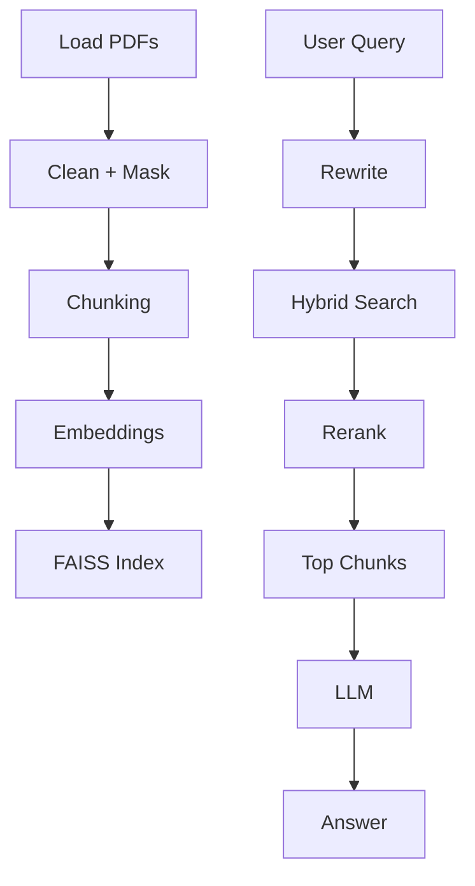

# 🧠 Production-Grade RAG — Complete Guide (19 Steps)


> End-to-end explanation of a **real-world Retrieval-Augmented Generation (RAG)** system with concepts, code snippets, and architecture diagrams.

---

## 1. Data Loading
Load PDFs/CSVs into documents.
```python
loader = PyPDFLoader("file.pdf")
docs = loader.load()
```

## 2. Preprocessing & Cleaning
Remove noise, normalize text.
```python
text = re.sub(r"\s+", " ", text).strip()
```

## 3. PII Masking
Hide sensitive info.
```python
text = re.sub(r"\d{10}", "[PHONE]", text)
```

## 4. Chunking
Split into smaller pieces.
```python
splitter = RecursiveCharacterTextSplitter(chunk_size=500, chunk_overlap=100)
chunks = splitter.split_text(text)
```

## 5. Embeddings
Convert text → vectors.
```python
model.encode(["What is RAG?"])
```

## 6. Vector DB
Store + search embeddings.
```python
index = faiss.IndexFlatL2(dim)
index.add(embeddings)
```

## 7. Retrieval
Get top-k relevant chunks.
```python
index.search(query_embedding, k=5)
```

## 8. Prompt + LLM
Generate answer using context.
```python
prompt = f"Context: {context}\nQuestion: {query}"
```

---

## 9. Query Reformulation
Improve user queries.
```python
"cnn vs transformer" → "difference between CNN and Vision Transformer"
```

## 10. Reranking
Re-score retrieved results.
```python
reranker.predict([(query, doc)])
```

## 11. Hybrid Retrieval
Combine dense + sparse.
```python
final = 0.5 * dense + 0.5 * bm25
```

## 12. Evaluation Metrics
Measure retrieval quality.
- Recall@k
- Precision

## 13. Latency vs Accuracy
Tradeoff tuning.
- more docs = better accuracy, slower

## 14. Distillation
Train smaller models from larger ones.

## 15. Hardware Constraints
Optimize for CPU/GPU/memory.

## 16. Retrieval Cache
Cache repeated queries.
```python
cache[query] = result
```

## 17. Hallucination Control
Force grounded answers.
```python
"If not found, say I don't know"
```

## 18. Error Analysis + Feedback
Improve using logs.
```python
feedback.append({query, correct_answer})
```

## 19. Secure Retrieval
Role-based filtering.
```python
if doc.role == user_role
```

## 20. Multi-hop Retrieval
Handle complex queries.
```python
step1 → refine → step2
```

## 21. Bias Check
Detect unfair outputs.
```python
if "only men" in output
```

---

# 🔁 Detailed Pipeline



---

# ⚡ Example Query Flow

**Query:** "What problem does ResNet solve?"

1. Reformulated → clearer query
2. Retrieved chunks from ResNet.pdf
3. Reranked best passages
4. LLM generates grounded answer

---

# 🧠 Key Takeaways

❌ Basic RAG = embeddings + vector DB  

✅ Production RAG =
- Retrieval (dense + sparse)
- Reranking
- Evaluation
- Optimization (latency, cache)
- Safety (hallucination, bias, security)

---

# 🚀 Future Improvements

- Add Streamlit UI
- Add RAGAS evaluation
- Use OpenAI embeddings
- Deploy on AWS / Vercel

---

# ⭐ If this helped

Give a ⭐ on GitHub and share 🚀

